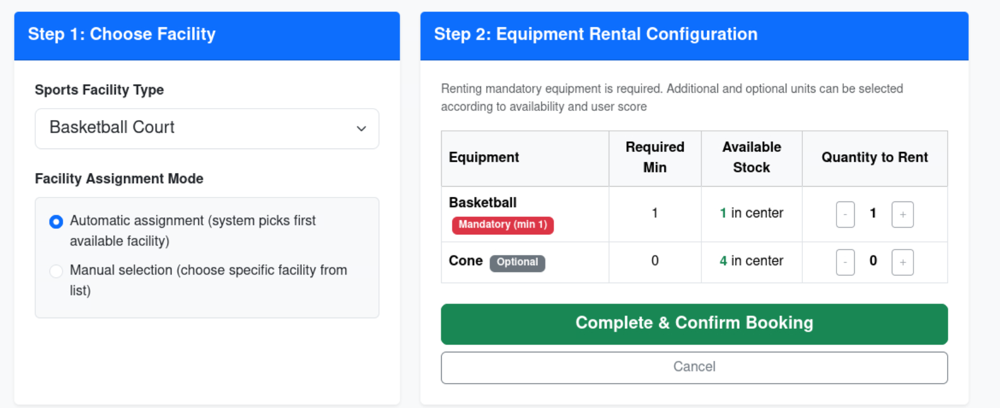

## React Client Application Routes

- Route `/`: Public availability view showing available counts for all sports facility types with its individual status plus rental equipment inventory
- Route `/login`: User authentication screen dedicated to 1-factor login
- Route `/login-totp`: Two-Factor Authentication (2FA) screen for verifying 6-digit TOTP codes generated using secret. Completing 2FA resets negative user score back to 0
- Route `/reservations`: Protected view displaying all active bookings for the logged-in user with facility identifiers, rented equipment details and buttons to edit equipment or cancel bookings
- Route `/new-reservation`: Protected booking form allowing users to select facility type, choose manual or automatic facility assignment and configure mandatory and optional equipment with available amount and user score validation

## List of HTTP API Endpoints Offered by the Backend Server

### User Management & Authentication

#### Login (1-Factor Authentication)
* `POST /api/sessions`
* Description: Authenticates the user with username and password
* Request body:
```JSON
{
  "username": "bob",
  "password": "password"
}
```
* Response: `200 OK`
```JSON
{
  "id": 2,
  "username": "bob",
  "name": "Bob",
  "score": -2,
  "canDoTotp": true,
  "isTotp": false
}
```
* Error responses: `401 Unauthorized`, `500 Internal Server Error`

#### Check Current User Session
* `GET /api/sessions/current`
* Description: Retrieves the currently authenticated user's session data and score.
* Request body: *None*
* Response: `200 OK`
```JSON
{
  "id": 2,
  "username": "bob",
  "name": "Bob",
  "score": -2,
  "canDoTotp": true,
  "isTotp": false
}
```
* Error responses: `401 Unauthorized`, `500 Internal Server Error`

#### Two-Factor Authentication (TOTP 2FA)
* `POST /api/login-totp`
* Description: Verifies a 6-digit TOTP code. On success, marks session as 2FA authenticated and resets negative score to 0
* Request body:
```JSON
{
  "code": "123456"
}
```
* Response: `200 OK`
```JSON
{
  "otp": "authorized",
  "user": {
    "id": 2,
    "username": "bob",
    "name": "Bob",
    "score": 0,
    "canDoTotp": true,
    "isTotp": true
  }
}
```
* Error responses: `401 Unauthorized`, `422 Unprocessable Content`, `500 Internal Server Error`

#### Logout
* `DELETE /api/sessions/current`
* Description: Destroys the current user session and clears authentication cookies
* Request body: *None*
* Response: `200 OK`
```JSON
{
  "message": "Logged out successfully"
}
```
* Error responses: `401 Unauthorized`, `500 Internal Server Error`

---

### Sport Center Facilities and Equipment Management

#### Public Availability Overview
* `GET /api/public/availability`
* Description: Returns counts and court statuses for all facility types and rental equipment stock
* Request body: *None*
* Response: `200 OK`
```JSON
{
  "facilities": [
    {
      "typeId": "TENNIS",
      "typeName": "Tennis Court",
      "totalCount": 3,
      "availableCount": 2,
      "facilityCodes": [
        { "code": "T1", "isBooked": false },
        { "code": "T2", "isBooked": false },
        { "code": "T3", "isBooked": true }
      ]
    }
  ],
  "equipment": [
    {
      "id": "TENNIS_RACKET",
      "name": "Tennis Racket",
      "totalQuantity": 8,
      "availableQuantity": 6
    }
  ]
}
```

#### Facility Types & Rules
* `GET /api/facility-types`
* Description: Retrieves the list of available facility types
* Request body: *None*
* Response: `200 OK`
```JSON
[
    {
        "id": "BASKETBALL",
        "name": "Basketball Court"
    },
    {
        "id": "CYCLING",
        "name": "Cycling Track"
    },
    {
        "id": "SOCCER",
        "name": "Soccer Field"
    },
    {
        "id": "TABLE_TENNIS",
        "name": "Table Tennis Table"
    },
    {
        "id": "TENNIS",
        "name": "Tennis Court"
    },
    {
        "id": "VOLLEYBALL",
        "name": "Volleyball Court"
    }
]
```
* Error responses: `401 Unauthorized`, `500 Internal Server Error`

* `GET /api/facility-types/:typeId/rules`
* Description: Retrieves equipment rental rules (mandatory minimums, optional items, and live inventory) for a given facility type
* Request body: *None*
* Response: `200 OK`
```JSON
[
    {
        "equipmentTypeId": "BASKETBALL",
        "equipmentName": "Basketball",
        "minQuantity": 1,
        "totalQuantity": 2,
        "availableQuantity": 1
    },
    {
        "equipmentTypeId": "CONE",
        "equipmentName": "Cone",
        "minQuantity": 0,
        "totalQuantity": 4,
        "availableQuantity": 4
    }
]
```
* Error responses: `401 Unauthorized`, `422 Unprocessable Entity`, `500 Internal Server Error`

#### All Individual Facilities
* `GET /api/facilities`
* Description: Retrieves all individual facilities with current availability status
* Authentication: Required (logged in user session)
* Request body: *None*
* Response: `200 OK`
```JSON
[
    {
        "id": "B1",
        "facilityTypeId": "BASKETBALL",
        "name": "Basketball Court #1",
        "typeName": "Basketball Court",
        "isAvailable": 0
    },
    {
        "id": "C2",
        "facilityTypeId": "CYCLING",
        "name": "Cycling Track #2",
        "typeName": "Cycling Track",
        "isAvailable": 1
    },
    {
        "id": "S1",
        "facilityTypeId": "SOCCER",
        "name": "Soccer Field #1",
        "typeName": "Soccer Field",
        "isAvailable": 1
    },
    {
        "id": "TT1",
        "facilityTypeId": "TABLE_TENNIS",
        "name": "Table Tennis Table #1",
        "typeName": "Table Tennis Table",
        "isAvailable": 0
    },
    {
        "id": "TT2",
        "facilityTypeId": "TABLE_TENNIS",
        "name": "Table Tennis Table #2",
        "typeName": "Table Tennis Table",
        "isAvailable": 1
    },
    {
        "id": "TT3",
        "facilityTypeId": "TABLE_TENNIS",
        "name": "Table Tennis Table #3",
        "typeName": "Table Tennis Table",
        "isAvailable": 1
    },
    {
        "id": "TT4",
        "facilityTypeId": "TABLE_TENNIS",
        "name": "Table Tennis Table #4",
        "typeName": "Table Tennis Table",
        "isAvailable": 1
    },
    {
        "id": "T1",
        "facilityTypeId": "TENNIS",
        "name": "Tennis Court #1",
        "typeName": "Tennis Court",
        "isAvailable": 1
    },
    {
        "id": "V1",
        "facilityTypeId": "VOLLEYBALL",
        "name": "Volleyball Court #1",
        "typeName": "Volleyball Court",
        "isAvailable": 0
    }
]
```
* Error responses: `401 Unauthorized`, `500 Internal Server Error`

---

### Reservations Management

#### Get User Reservations
* `GET /api/reservations`
* Description: Fetches all active reservations for the logged-in user, including allocated equipment
* Request body: *None*
* Response: `200 OK`
```JSON
[
  {
    "reservationId": 1,
    "facilityId": "B1",
    "facilityName": "Basketball Court #1",
    "facilityTypeId": "BASKETBALL",
    "typeName": "Basketball Court",
    "equipments": [
      {
        "equipmentTypeId": "BASKETBALL",
        "equipmentName": "Basketball",
        "quantity": 1,
        "minQuantity": 1,
        "isMandatory": true
      }
    ]
  }
]
```
* Error responses: `401 Unauthorized`, `500 Internal Server Error`

#### Create a New Reservation
* `POST /api/reservations`
* Description: Creates a facility reservation with required equipment. Enforces 30s cooldown, mandatory minimums, inventory availability, and negative score restrictions
* Request body:
```JSON
{
  "facilityTypeId": "TENNIS",
  "facilityId": "T1",
  "automaticFacilitySelection": 0,
  "equipments": [
    { "equipmentTypeId": "TENNIS_RACKET", "quantity": 2 },
    { "equipmentTypeId": "TENNIS_BALL", "quantity": 3 },
    { "equipmentTypeId": "TOWEL", "quantity": 1 }
  ]
}
```
* Response: `201 Created`
```JSON
{
  "message": "Facility and equipment reserved successfully!",
  "reservationId": 5,
  "facilityId": "T1",
  "facilityName": "Tennis Court #1"
}
```
* Error responses: `401 Unauthorized`, `403 Forbidden` (score violation or 30 seconds cooldown active), `422 Unprocessable Content` (missing mandatory equipment or insufficient stock), `500 Internal Server Error`

#### Edit Equipment Quantities For an Existing Reservation
* `PUT /api/reservations/:reservationId/equipment`
* Description: Modify equipment quantities for an active reservation owned by the user
* Request body:
```JSON
{
  "equipments": [
    { "equipmentTypeId": "TENNIS_RACKET", "quantity": 2 },
    { "equipmentTypeId": "TENNIS_BALL", "quantity": 4 }
  ]
}
```
* Response: `200 OK`
```JSON
{
  "message": "Reservation equipment modified successfully!"
}
```
* Error responses: `401 Unauthorized`, `403 Forbidden`, `404 Not Found`, `422 Unprocessable Content`, `500 Internal Server Error`

#### Delete an Existing Reservation
* `DELETE /api/reservations/:reservationId`
* Description: Cancels a reservation, releases facilities and equipment, decrements user score by 1, and records 30s cooldown timestamp
* Request body: *None*
* Response: `200 OK`
```JSON
{
  "message": "Reservation cancelled successfully. Your score has been reduced by 1.",
  "newScore": -3,
  "cooldownFacilityTypeId": "TENNIS"
}
```
* Error responses: `401 Unauthorized`, `403 Forbidden`, `404 Not Found`, `500 Internal Server Error`

---

## Database Tables

- Table `users`: Contains `id`, `username`, `password_hash`, `salt`, `score`, `totp_secret`, `lastTotpStep`
- Table `facility_types`: Contains `id`, `name`
- Table `facilities`: Contains `id`, `facility_type_id`, `name`
- Table `equipment_types`: Contains `id`, `name`, `total_quantity`
- Table `facility_equipment_rules`: Contains `facility_type_id`, `equipment_type_id`, `min_quantity`
- Table `reservations`: Contains `id`, `user_id`, `facility_id`
- Table `reservation_equipment`: Contains `reservation_id`, `equipment_type_id`, `quantity`
- Table `facility_release_logs`: Contains `id`, `user_id`, `facility_type_id`, `released_at`

---

## Main React Components

- `Navigation` (in `src/components/Navigation.jsx`): Navbar displaying application sections, score badge, 2FA status and buttons to logout and perform 2FA authentication
- `PublicView` (in `src/views/PublicView.jsx`): Overview of all 6 facility types with status badges for each facility, plus the rental equipment table
- `LoginView` (in `src/views/LoginView.jsx`): User credentials authentication form with password visibility toggle
- `TotpView` (in `src/views/TotpView.jsx`): 2-Factor Authentication screen for TOTP validation with score reset explanation
- `MyReservationsView` (in `src/views/MyReservationsView.jsx`): User reservations dashboard with equipment details, edit equipment modal trigger, and cancellation confirmation dialog with score warnings
- `NewReservationView` (in `src/views/NewReservationView.jsx`): 2 step booking creation interface supporting manual or automatic facility selection, mandatory equipment locking, and score restrictions
- `EditReservationModal` (in `src/components/EditReservationModal.jsx`): Interactive modal for adjusting equipment quantities for active bookings while enforcing mandatory minimums and stock limits
- `ScoreBadge` (in `src/components/ScoreBadge.jsx`): Visual badge showing user score and penalty status with explanatory tooltips

---

## Facility Selection Page



---

## Users Credentials and Initial State

|  username  |  plain-text password  |  initial_score  |   number_of_reservations  |
|------------|-----------------------|-----------------|---------------------------|
|   alice    |       password        |        0        |            0              |
|   bob      |       password        |       -2        |            1              |
|   carol    |       password        |       -1        |            1              |
|   dave     |       password        |        0        |            2              |
